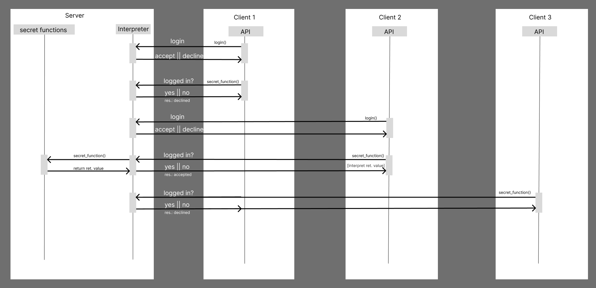

### Files in this Directory:

**Client-Server 1.png**:
- This graphic depicts the interaction between a client and a server. It demonstrates how the client communicates with the server, and in return, the server responds to the client's requests.
- Each Raspi can be a server or a client or even both

**Architecture-Request-Response.png**:
- This file illustrates how a client can interact with the server through the API, showcasing the process of a client calling a function on the server.
- The "secret functions" in this context refer to the core server-side functions, including GPIO header usage, file operations, and command processing.

