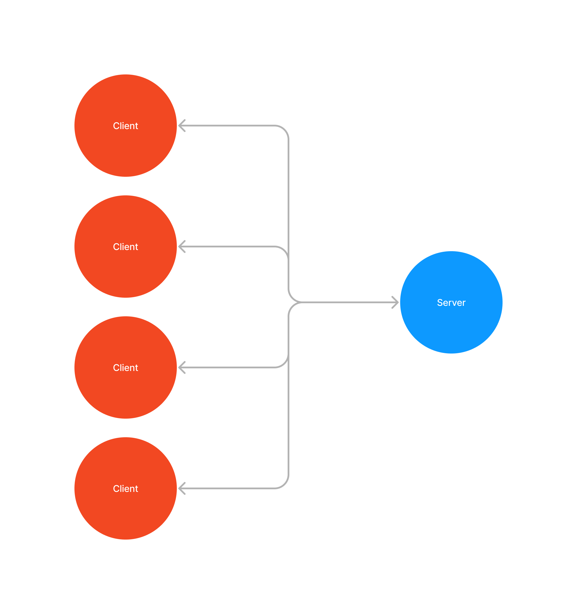

### Files in this Directory:

**Client-Server-Abstraction**:
- This graphic depicts the interaction between a client and a server. It demonstrates how the client communicates with the server, and in return, the server responds to the client's requests.
- Each Raspi can be a server or a client or even both

**Architecture-Request-Response**:
- This file illustrates how a client can interact with the server through the API, showcasing the process of a client calling a function on the server.
- The "secret functions" in this context refer to the core server-side functions, including GPIO header usage, file operations, and command processing.

### API Datapackets

- **LOGIN = "0000" + password**
- **LOGOUT = "0010"**
- **GETDATA = "0022" + path to file**

### Data Packet Structure

- **Byte 1:** `0x00` = Request, `0x01` = Response
- **Byte 2:** `0x00` = None, (`0x01` = Success, `0x02` = Failure) -> response from the previous data packet
- **Byte 3:** `0x00` = Login, `0x01` = Logout, `0x02` = Get Data, `0x03` = Set Data
- **Byte 4:** `0x00` = No Data, `0x01` = Commands, `0x02` = File, `0x03` = Database -> data from database
- **Bytes 5 - n:** Data

#### Login Request:
- **Byte 1:** `0x00` = Request
- **Byte 2:** `0x00` = None
- **Byte 3:** `0x00` = Login
- **Byte 4:** `0x00` = No Data
- **Bytes 5 - n:** pwd (password)

#### Logout Request:
- **Byte 1:** `0x00` = Request
- **Byte 2:** `0x00` = None
- **Byte 3:** `0x01` = Logout
- **Byte 4:** `0x00` = No Data

#### Get Data Request:
- **Byte 1:** `0x00` = Request
- **Byte 2:** `0x00` | `0x01` | `0x02` = None | Success | Failure
- **Byte 3:** `0x02` = Get Data
- **Byte 4:** `0x01` | `0x02` | `0x03` = Commands | File | Database

#### Response:
- **Byte 1:** `0x01` = Response
- **Byte 2:** `0x01` = Success, `0x02` = Failure
- **Byte 3 and onwards:** Response data

### Return Values:
- **1:** File sent
- **0:** Login successful
- **-1:** Unable to interpret the data packet
- **-2:** Unable to open the file
- **-3:** Client is already connected
- **-4:** Login failed
- **-5:** Logout failed
- **-6:** Client is not logged in
- **-7:** No rights for the command
